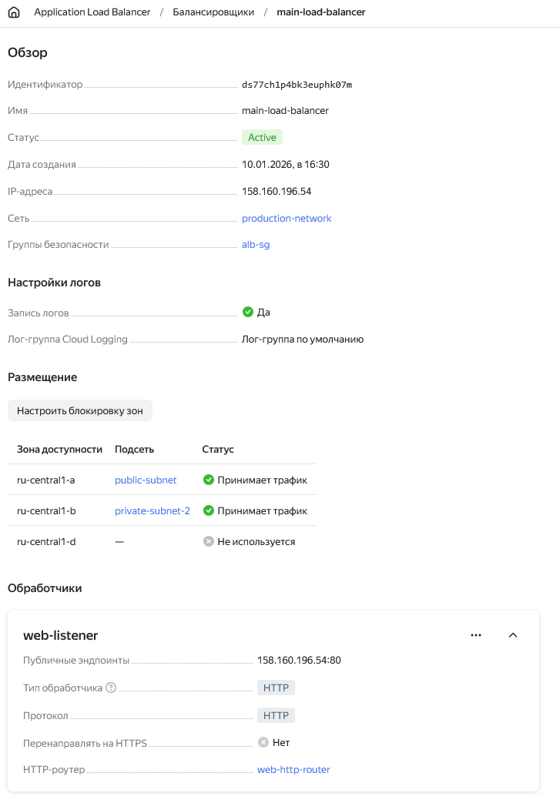

Файлы terraform:
- vm.tf (виртуальные машины)
- network.tf (сеть и группы безопасности)
- variables.tf (объявление переменных, значения в приватном tfvars)
- hosts.tftpl (шаблон инвентаря для ансибла)

Пароли для создаваемых ансиблом учеток - в приватном файле group_vars/all.yml

